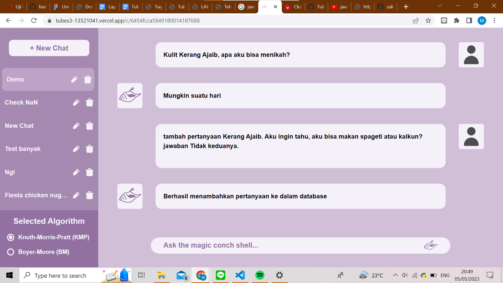
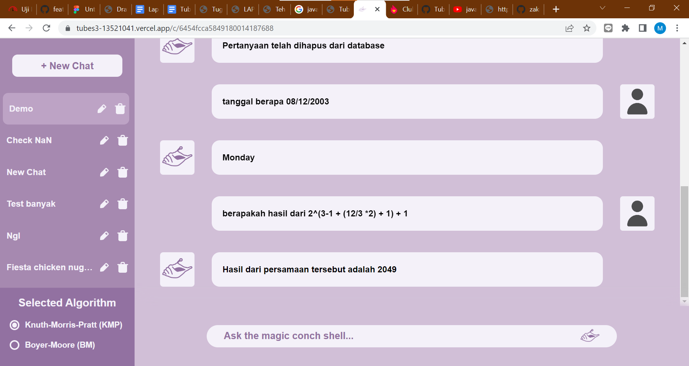
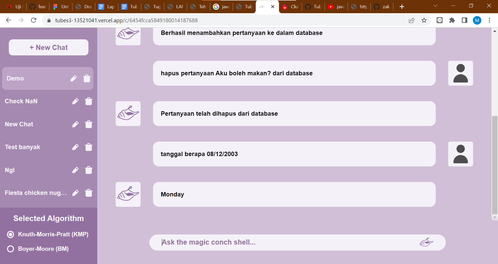

# Tubes3_13521041

# Penerapan String Matching dan Regular Expression dalam Pembuatan ChatGPT Sederhana

> Program ini ditujukan untuk memenuhi Tugas Besar Strategi Algoritma IF2211 tahun ajaran 2022/2023

> Aplikasi web yang dibangun adalah aplikasi chatbot sederhana yang memiliki beberapa fitur. Aplikasi ini dapat Mencocokkan pertanyaan dari input pengguna ke pertanyaan di database menggunakan algoritma KMP atau BM. Pengguna dapat menambahkan dan menghapus pertanyaan serta jawabannya sendiri ke database dengan kueri chat tertentu. Aplikasi ini juga menyediakan fitur kalkulator dan tanggal 

## Fitur Aplikasi
- Fitur pertanyaan teks (didapat dari database)
- Fitur kalkulator
- Fitur tanggal
- Fitur tambah pertanyaan dan jawaban ke database
- Fitur hapus pertanyaan dari database

## Setup Program
- Pastikan di komputer Anda telah terinstall Node JS
- Clone repositori ini ke directory yang diinginkan dengan command 
  ```
  cd /{direktori-yang-diinginkan}
  git clone 'https://github.com/zakia215/Tubes3_13521041.git'
  ```
- Pindah direktori ke folder hasil clone repositori

## Cara Menjalankan Program
- Cara menjalankan Backend program:
    - Pindah ke directory backend
      ```
      cd src/server
      ```
    - Install semua dependencies:
      ```sh
      npm install
      ```
    - Jalankan program
      ```
      npm run start
      ```
- Cara menjalankan Frontend program:
    - Pindah ke directory frontend
      ```
      cd src/client
      ```
    - Install semua dependencies:
      ```sh
      npm install
      ```
    - Jalankan program
      ```sh
      npm run dev
      ```

## Tampilan Program
- Fitur pertanyaan teks dan tambah pertanyaan



- Fitur tanggal dan kalkulator



- Fitur hapus pertanyaan



## Developer
- Muhammad Hanan		 	    (13521041)
- Muhammad Zaki Amanullah	    (13521146)
- Muchammad Dimas Sakti W.  	(13521160)